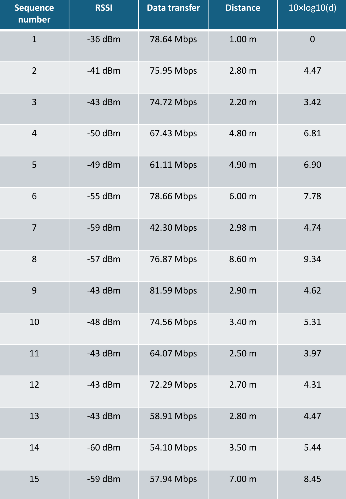
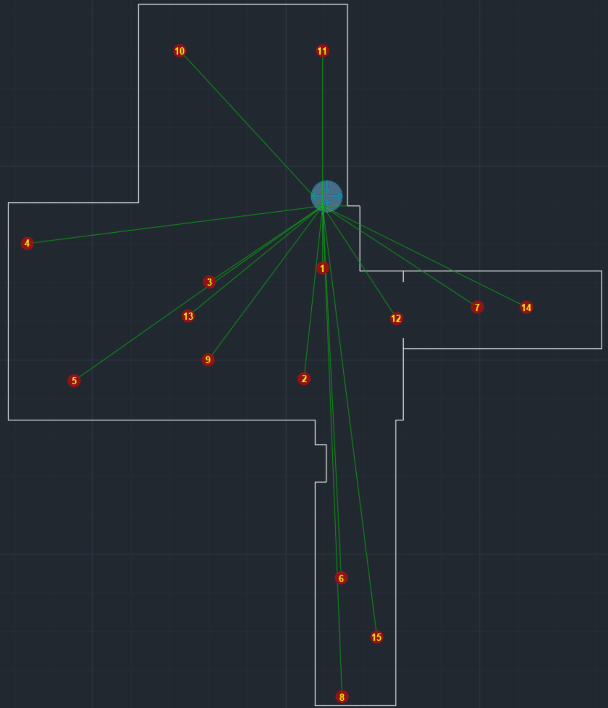
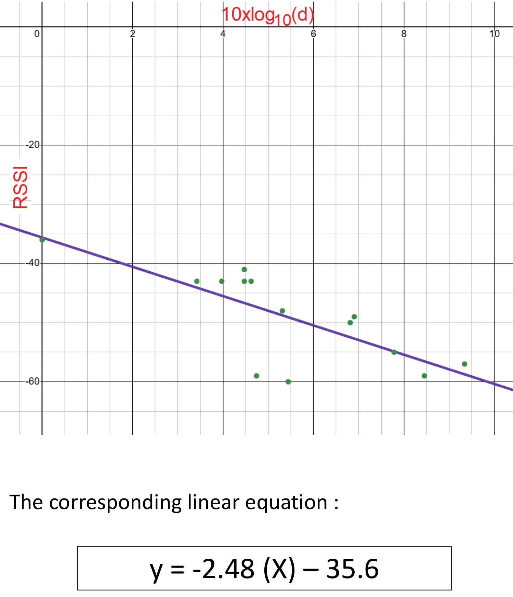
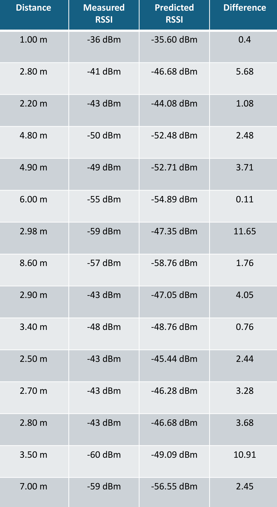
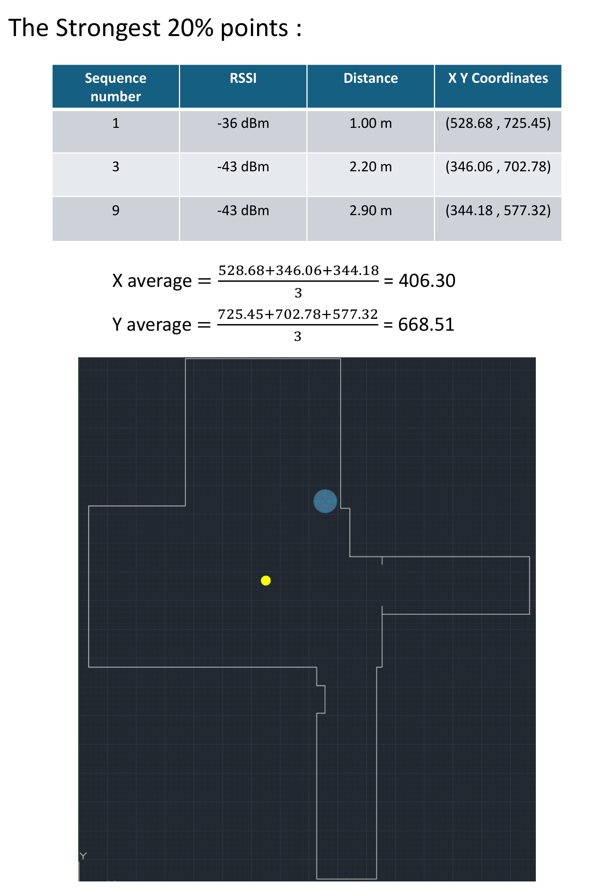

# WiMAP WiFi Access Point Localization using RSSI

This project implements the **WiMAP (Where is My Access Point)** algorithm for estimating the location of a WiFi Access Point using **Received Signal Strength Indicator (RSSI)** measurements.

The implementation is based on the research paper:

"WiMAP: an Efficient Wi-Fi Access Point Localization Mechanism"  
Presented at the International Computer Sciences and Informatics Conference (ICSIC).

---

## Project Overview

Wireless localization is an important technique used in indoor navigation, wireless network optimization, and security analysis.

The WiMAP algorithm estimates the location of a WiFi Access Point by:

1. Collecting RSSI measurements at known locations
2. Filtering the strongest signal measurements
3. Applying a centroid-based localization method

Compared with traditional centroid-based approaches, WiMAP improves localization accuracy by **ignoring weak signal samples that introduce positioning errors**.

---

# 1. RSSI Sample Collection

The first step was to collect RSSI measurements at different locations inside the room.  
For each measurement point, the following parameters were recorded:

- RSSI (Received Signal Strength Indicator)
- Data transfer rate (Mbps)
- Distance from the Access Point (meters)
- $10 \cdot \log_{10}(d)$ used in the path-loss calculation

  
   
  <em>Figure 1: Collected RSSI measurements at different positions.</em>

A total of **15 measurement points** were collected across the room.

---

# 2. Mapping the Measurement Points

After collecting the samples, the measurement points were plotted on the room layout according to their coordinates using AutoCAD.

This step helps visualize the distribution of the collected RSSI samples.

  
   
  <em>Figure 2: Room layout showing the mapped measurement points where RSSI samples were collected.</em>

Each point represents a location where RSSI measurements were taken.

---

# 3. Path Loss Model Estimation

Using the collected RSSI data, a regression model was used to estimate the indoor path loss.

$$RSSI = -2.48 \cdot (10 \cdot \log_{10}(d)) - 35.6$$
Where:

- d = distance from the access point
- n = 2.48 (estimated propagation exponent)
- RSSI at 1 meter = -35.6 dBm

This model helps describe how signal strength decreases with distance.

  
   
  <em>Figure 3: Estimated indoor path loss model derived from the collected RSSI measurements.</em>

Using this equation, we can compare the predicted RSSI values with the measured RSSI values at different distances.

  
   
  <em>Figure 4: Comparison between the measured RSSI values and the RSSI values predicted by the path loss model.</em>

---

# 4. WiMAP Localization and Estimated Access Point Location

The WiMAP algorithm estimates the Access Point location using the following steps:

1. Sort RSSI samples by signal strength
2. Select the strongest 20% of samples
3. Compute the centroid of those locations

Centroid calculation:

$x_{AP} = \frac{\sum_{i=1}^{N} x_i}{N}$

$y_{AP} = \frac{\sum_{i=1}^{N} y_i}{N}$

Where N is the number of selected sample points.

The estimated AP position is shown in the figure below.

  
   
  <em>Figure 5: Estimated Access Point location obtained using the WiMAP localization algorithm.</em>

Using the strongest RSSI samples, the estimated Access Point position was calculated.

Estimated Coordinates:

X = 406.30  
Y = 668.51

Due to the limited dataset (15 samples), the estimated location deviates from the true AP position. Increasing the number of samples would improve localization accuracy.

---
